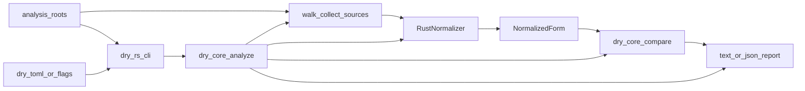
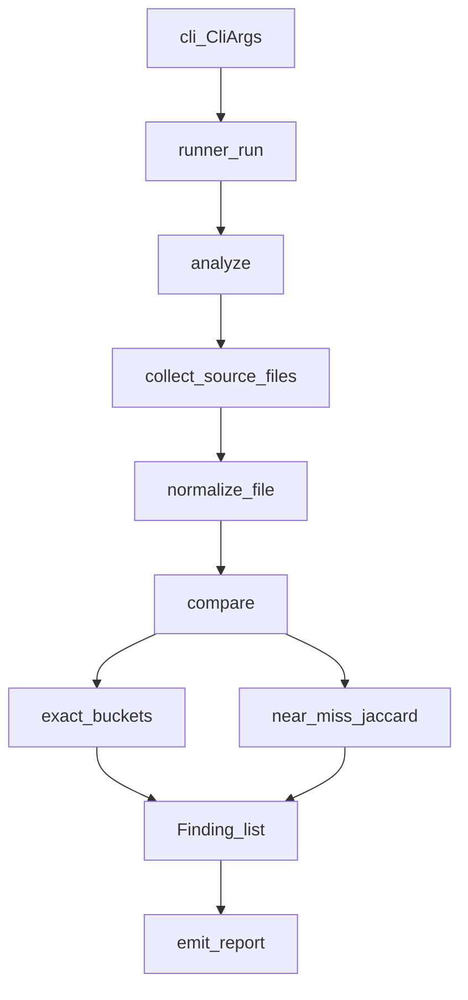
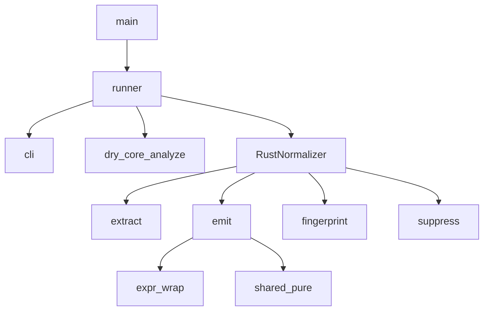

# Architecture document

dry-score detects **structural clones** in source code. It compares normalized
AST forms—not raw text—scores pairs with multiset Jaccard similarity over
subtree fingerprint bags, and routes findings into agentic tiers for CI and
automation. It is a duplication detector. It is not a style linter or a
complexity scorer.

Use this page to place a change in the right crate and to follow one analysis
run from roots to report.

## Purpose and scope

**Readers:** agents and human contributors who edit this workspace.

**Prerequisites:** Rust and `cargo`; basic CLI use. You do not need prior
dry-score internals.

**After you read this page, you can:**

- Name what `dry-core` owns versus what `dry-rs` owns
- Trace discover → normalize → compare → report
- Find the module for a change
- Respect the hard invariants below

### This file covers

- Workspace crate roles
- End-to-end analysis flow
- `dry-core` and `dry-rs` module maps
- Hard invariants
- Verification and agent layout

### This file does not cover

- Install steps, CLI flags, and usage examples — see [README.md](../../README.md)
- Domain map, tiers, and fingerprint rules as a skill — see
  [dry-rs-domain](../skills/dry-rs-domain/SKILL.md)
- Self-scan cleanup (dedupe versus ignore) — see
  [dry-dogfood](../skills/dry-dogfood/SKILL.md)
- Full local versus CI steps — see [verify-gates](../skills/verify-gates/SKILL.md)
  and [AGENTS.md](../../AGENTS.md)
- Formatting and SOLID conventions — see
  [rust-style-guide](../skills/rust-style-guide/SKILL.md) and
  [rust-solid-design](../skills/rust-solid-design/SKILL.md)

## System context

Point `dry-rs` at one or more analysis roots. The CLI loads config (walk-up
`dry.toml` or `--config`), walks sources without following symlinks, normalizes
each file through the Rust adapter, compares forms in `dry-core`, and renders
text, JSON, or both.

**Ownership:**

- `dry-rs` owns argv, config overlays, the `syn` normalizer, and process exit.
- `dry-core` owns walk application, orchestration (`analyze`), comparison,
  domain types, and report rendering. `dry-core` has **no** AST crate
  dependencies.

**Runtime bar:**

- Rust toolchain **1.94.0** ([`rust-toolchain.toml`](../../rust-toolchain.toml))
- Workspace members: `dry-core`, `dry-rs`, `dry-go` ([`Cargo.toml`](../../Cargo.toml))
- Language adapters implement
  [`LanguageNormalizer`](../../crates/dry-core/src/ports/normalizer.rs) and
  reuse the same comparison engine
- Shared argv/report helpers live in `dry-core` (`cli`, `runner`); adapters supply
  a normalizer and thin binary entrypoints
- `NormNode` + FNV fingerprinting live in `dry-core::norm` (no AST deps)
- Workspace lint `unsafe_code` is allow so Tree-sitter can link; `dry-core` and
  `dry-rs` still `#![forbid(unsafe_code)]`. `dry-go` writes no `unsafe` in-tree.

*Figure: analysis roots and config enter `dry-rs`; `dry-core` walks, normalizes
via the adapter, compares forms, and emits the report.*



## Workspace crates

| Crate | Role |
| ----- | ---- |
| [`crates/dry-core`](../../crates/dry-core) | Language-agnostic domain, walk, config, compare, shared CLI/runner, reporters |
| [`crates/dry-rs`](../../crates/dry-rs) | Rust `syn` adapter and the `dry-rs` binary |
| [`crates/dry-go`](../../crates/dry-go) | Go Tree-sitter adapter and the `dry-go` binary |

Adapters depend on `dry-core` and plug in through `LanguageNormalizer`.

Exit codes and report I/O live in [`runner`](../../crates/dry-core/src/runner.rs).
Flag parsing lives under [`cli/`](../../crates/dry-core/src/cli/).

## High-level analysis flow

A `dry-rs` run proceeds as follows:

1. Parse argv into [`CliArgs`](../../crates/dry-rs/src/cli/mod.rs) (paths,
   effective `Config`, optional `--json-out`).
2. Build [`RustNormalizer`](../../crates/dry-rs/src/normalize/mod.rs) from
   `walk.min_nodes` and `walk.min_lines`.
3. Call [`analyze`](../../crates/dry-core/src/analyze.rs):
   1. Collect sources with
      [`walk::collect_source_files`](../../crates/dry-core/src/walk.rs).
   2. Normalize each file (skip files over `walk.max_file_bytes` with a
      warning; warn on unreadable paths; emit no forms when the file opts out).
   3. [`compare`](../../crates/dry-core/src/compare/mod.rs) forms at
      `gate.threshold`.
   4. Build the summary and [`Report`](../../crates/dry-core/src/report/mod.rs).
4. Emit text and/or JSON. Map `fail_on_findings` to the process exit code.

*Figure: the runner drives analyze; compare splits into exact buckets and
near-miss Jaccard before emit.*



### Matching

Identical fingerprint bags score `1.0`. Identifier traces then label the clone
as Type-1 (same ids) or Type-2 (renamed). Remaining forms use an inverted
fingerprint index and connected-component near-miss multiset Jaccard (Type-3;
score is the minimum edge Jaccard in the component; window uses total bag size
`Σ` counts). Production and test forms (`FormKind`) never pair. Findings sort
most exact to least exact.

JSON reports serialize fingerprints as a map from hash string/number to count
(BREAKING versus the former unique-hash set).

### Tiers

| Tier | Score band |
| ---- | ---------- |
| `auto_refactor` | ≥ 0.95 |
| `review_first` | ≥ 0.85 |
| `advisory` | ≥ threshold and &lt; 0.85 |

When the configured threshold is ≥ 0.85, emitted findings do not use the
advisory band. Detail: [dry-rs-domain](../skills/dry-rs-domain/SKILL.md).

## `dry-core` module map

Barrel: [`crates/dry-core/src/lib.rs`](../../crates/dry-core/src/lib.rs).
Pipeline entry: [`analyze`](../../crates/dry-core/src/analyze.rs).

| Area | Path | Role |
| ---- | ---- | ---- |
| Orchestration | [`analyze.rs`](../../crates/dry-core/src/analyze.rs) | Walk → normalize → compare → summary → `Report` |
| Walk | [`walk.rs`](../../crates/dry-core/src/walk.rs) | Recursive discovery; no symlink follow; symlink roots error; exclude by path component |
| Config | [`config.rs`](../../crates/dry-core/src/config.rs) | TOML load, walk-up discover, threshold validate, `OutputFormat` |
| Port | [`ports/normalizer.rs`](../../crates/dry-core/src/ports/normalizer.rs) | `LanguageNormalizer`, `NormalizeOutcome`, `NormalizeError` |
| Compare | [`compare/mod.rs`](../../crates/dry-core/src/compare/mod.rs) | Exact buckets, near-miss, sort |
| Jaccard | [`compare/jaccard.rs`](../../crates/dry-core/src/compare/jaccard.rs) | Multiset similarity (`Σ min / Σ max`) |
| Classify | [`compare/classify.rs`](../../crates/dry-core/src/compare/classify.rs) | `CloneType` and `Tier` from score and idents |
| Domain | [`domain/`](../../crates/dry-core/src/domain/mod.rs) | `NormalizedForm`, `Finding`, spans, summary, enums |
| Report | [`report/`](../../crates/dry-core/src/report/mod.rs) | Text and JSON envelopes |

## `dry-rs` module map

[`main.rs`](../../crates/dry-rs/src/main.rs) calls
[`runner::run_from_env`](../../crates/dry-rs/src/runner.rs). The runner parses
the CLI, calls `dry_core::analyze` with `RustNormalizer`, then emits the report.

| Area | Path | Role |
| ---- | ---- | ---- |
| CLI | [`cli/`](../../crates/dry-core/src/cli/mod.rs) | Shared args, errors, parse orchestration |
| Flag apply | [`cli/apply.rs`](../../crates/dry-core/src/cli/apply.rs) | One-flag appliers and config overlays |
| Runner | [`runner.rs`](../../crates/dry-rs/src/runner.rs) | Thin Rust wrapper around `run_analysis` |
| Normalizer | [`normalize/mod.rs`](../../crates/dry-rs/src/normalize/mod.rs) | `RustNormalizer` / `LanguageNormalizer` |
| Extract | [`normalize/extract/`](../../crates/dry-rs/src/normalize/extract/) | Named forms from items, impls, trait defaults, and closures (`$closure:L{line}`) |
| Emit / macros | [`normalize/emit/mac.rs`](../../crates/dry-rs/src/normalize/emit/mac.rs) | Allowlisted macros expand to expr children; others keep token-tree shape |
| Emit | [`normalize/emit/`](../../crates/dry-rs/src/normalize/emit/mod.rs) | Structural tree emission (expr, pat, lit, mac, ops) |
| Expr wrap | [`normalize/emit/expr/wrap.rs`](../../crates/dry-rs/src/normalize/emit/expr/wrap.rs) | Recursive emit helpers (optional, unary, block, pair, range) |
| Shared emit | [`normalize/emit/shared.rs`](../../crates/dry-rs/src/normalize/emit/shared.rs) | Pure helpers only (must not import `expr`) |
| Fingerprint | [`norm/fingerprint.rs`](../../crates/dry-core/src/norm/fingerprint.rs) | Fixed FNV-1a subtree hashes → fingerprint bag (hash → count) |
| Suppress | [`normalize/suppress.rs`](../../crates/dry-rs/src/normalize/suppress.rs) | Full-line `dry-rs:ignore` / `ignore-file` |
| Placeholders | [`placeholders.rs`](../../crates/dry-core/src/placeholders.rs) | Positional ident renaming |
| Tree | [`norm/tree.rs`](../../crates/dry-core/src/norm/tree.rs) | `NormNode` leaf and branch |

## `dry-go` module map

[`main.rs`](../../crates/dry-go/src/main.rs) calls
[`runner::run_from_env`](../../crates/dry-go/src/runner.rs), which parses argv via
`dry-core` (`bin_name: "dry-go"`, force `extensions = ["go"]`) and runs
[`GoNormalizer`](../../crates/dry-go/src/normalize/mod.rs).

| Area | Path | Notes |
| ---- | ---- | ----- |
| Runner | [`runner.rs`](../../crates/dry-go/src/runner.rs) | Thin `CliOptions` + `run_analysis` |
| Normalizer | [`normalize/mod.rs`](../../crates/dry-go/src/normalize/mod.rs) | `GoNormalizer` / `LanguageNormalizer` |
| Parse | [`normalize/parse.rs`](../../crates/dry-go/src/normalize/parse.rs) | Thread-local Tree-sitter parser; soft `has_error` + partial CST |
| Extract | [`normalize/extract.rs`](../../crates/dry-go/src/normalize/extract.rs) | Funcs, methods, `func_literal` |
| Emit | [`normalize/emit.rs`](../../crates/dry-go/src/normalize/emit.rs) | CST → `NormNode` |
| Suppress | [`normalize/suppress.rs`](../../crates/dry-go/src/normalize/suppress.rs) | Full-line `dry-go:ignore` |

*Figure: `main` → runner → CLI and analyze; the normalizer extracts, emits,
fingerprints, and applies suppress markers.*



## Hard invariants

| Invariant | Why |
| --------- | --- |
| `dry-core` has no AST dependencies | Adapters own parsing; the core stays reusable |
| Adapters implement `LanguageNormalizer`; scoring stays in `dry-core` | Do not fork Jaccard or tier rules in an adapter |
| Fingerprints are toolchain-stable and location-independent | Do not bake spans or absolute paths into hashes |
| Digests are 64-bit FNV-1a | Birthday collisions are theoretically possible (rare false similarity); accepted for local analysis |
| `emit/shared` must not import `expr` | Avoids a shared↔expr cycle; recursive wraps live in `expr/wrap` |
| The walker does not follow symlinks | Analysis stays on the lexical tree under each root |
| Symlink analysis roots are rejected | Avoids silent empty runs when the root itself is a link |
| Production and test forms never pair | Avoids false clones across `FormKind` |
| No `#[allow]`; use `#[expect(..., reason = "...")]` | Matches workspace lints; see [rust-style-guide](../skills/rust-style-guide/SKILL.md) |
| Workspace members are `dry-core`, `dry-rs`, and `dry-go` | Update this document if you add or rename crates |

## Exit codes

| Code | Meaning | What to do |
| ---- | ------- | ---------- |
| `0` | Success (including `--help`) | Nothing required |
| `1` | Findings present and fail-on-findings is on | Inspect the report; fix clones or turn off fail-on if you only needed a report |
| `2` | Usage, config, or hard analysis error | Fix flags or config; see [README.md](../../README.md) |

## Trust boundary

`dry-rs` is a local analysis tool. The binary does not open network sockets or
execute untrusted code. The walker does not follow file or directory symlinks,
and rejects a symlink as an analysis root. Residual risk is local filesystem
read under the chosen roots—not remote code execution.

## Verification and agent layout

Run full local gates (fmt, Clippy, deny, audit, test, dry-rs self-scan and
dry-go dogfood scan with `findings=0`):

```bash
./scripts/verify.sh full
```

For a faster loop (fmt, Clippy, test only):

```bash
./scripts/verify.sh lite
```

The dry-go gate scans [`crates/dry-go/dogfood/`](../../crates/dry-go/dogfood/)
(unique non-clone corpus) because production Go sources outside fixtures are
absent from this repo.
Detail: [verify-gates](../skills/verify-gates/SKILL.md), or run `/verify`.

Agent support lives under `.agents/`:

- `docs/` — this architecture file
- `skills/` — verify, dogfood, domain, Rust style, SOLID
- `commands/` — `/verify`, `/dry-dogfood`, `/design-scan`
- `rules/` — gate contract (always on), AI slop mitigation (opt-in)
- `hooks/` — rustfmt after edit

See [AGENTS.md](../../AGENTS.md) for the full index.
