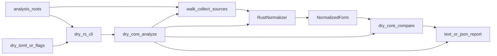
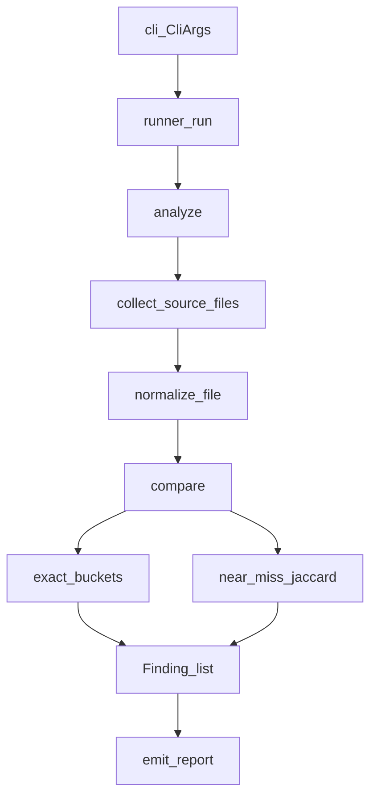
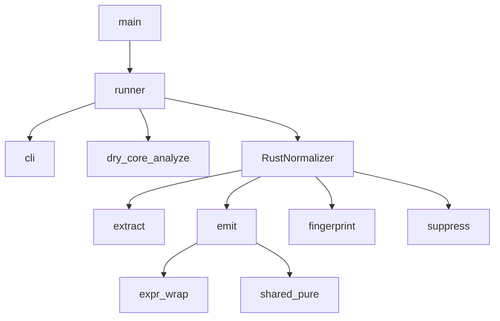

# Architecture document

dry-score detects **structural clones** in source code. It compares normalized
AST forms—not raw text—scores pairs with multiset Jaccard similarity over
subtree fingerprint bags, and routes findings into agentic tiers for CI and
automation. It is a duplication detector. It is not a style linter or a
complexity scorer.

Use this page to place a change in the right crate and to follow one analysis
run from roots to report.

## Purpose and scope

**Readers:** agents and human contributors who edit this workspace.

**Prerequisites:** Rust and `cargo`; basic CLI use. You do not need prior
dry-score internals.

**After you read this page, you can:**

- Name what `dry-core` owns versus what `dry-rs` owns
- Trace discover → normalize → compare → report
- Find the module for a change
- Respect the hard invariants below

### This file covers

- Workspace crate roles
- End-to-end analysis flow
- `dry-core` and `dry-rs` module maps
- Hard invariants
- Verification and agent layout

### This file does not cover

- Install steps, CLI flags, and usage examples — see [README.md](../../README.md)
- Domain map, tiers, and fingerprint rules as a skill — see
  [dry-rs-domain](../skills/dry-rs-domain/SKILL.md)
- Self-scan cleanup (dedupe versus ignore) — see
  [dry-dogfood](../skills/dry-dogfood/SKILL.md)
- Full local versus CI steps — see [verify-gates](../skills/verify-gates/SKILL.md)
  and [AGENTS.md](../../AGENTS.md)
- Formatting and SOLID conventions — see
  [rust-style-guide](../skills/rust-style-guide/SKILL.md) and
  [rust-solid-design](../skills/rust-solid-design/SKILL.md)

## System context

Point `dry-rs` at one or more analysis roots. The CLI loads config (walk-up
`dry.toml` or `--config`), walks sources without following symlinks, normalizes
each file through the Rust adapter, compares forms in `dry-core`, and renders
text, JSON, or both.

**Ownership:**

- `dry-rs` owns argv, config overlays, the `syn` normalizer, and process exit.
- `dry-core` owns walk application, orchestration (`analyze`), comparison,
  domain types, and report rendering. `dry-core` has **no** AST crate
  dependencies.

**Runtime bar:**

- Rust toolchain **1.94.0** ([`rust-toolchain.toml`](../../rust-toolchain.toml))
- Workspace members: `dry-core`, `dry-rs`, `dry-go`, `dry-ts`, `dry-py` ([`Cargo.toml`](../../Cargo.toml))
- Language adapters implement
  [`LanguageNormalizer`](../../crates/dry-core/src/ports/normalizer.rs) and
  reuse the same comparison engine
- Shared argv/report helpers live in `dry-core` (`cli`, `runner`); adapters supply
  a normalizer and thin binary entrypoints
- `NormNode` + FNV fingerprinting live in `dry-core::norm` (no AST deps)
- Workspace lint `unsafe_code` is allow so Tree-sitter can link; `dry-core` and
  `dry-rs` still `#![forbid(unsafe_code)]`. `dry-go`, `dry-ts`, and `dry-py`
  write no `unsafe` in-tree.

*Figure: analysis roots and config enter `dry-rs`; `dry-core` walks, normalizes
via the adapter, compares forms, and emits the report.*


```mermaid
flowchart LR
  Roots[analysis_roots] --> Cli[dry_rs_cli]
  Config[dry_toml_or_flags] --> Cli
  Cli --> Analyze[dry_core_analyze]
  Roots --> Walk[walk_collect_sources]
  Walk --> Norm[RustNormalizer]
  Norm --> Forms[NormalizedForm]
  Forms --> Compare[dry_core_compare]
  Compare --> Report[text_or_json_report]
  Analyze --> Walk
  Analyze --> Norm
  Analyze --> Compare
  Analyze --> Report
```

## Workspace crates

| Crate | Role |
| ----- | ---- |
| [`crates/dry-core`](../../crates/dry-core) | Language-agnostic domain, walk, config, compare, shared CLI/runner, reporters |
| [`crates/dry-rs`](../../crates/dry-rs) | Rust `syn` adapter and the `dry-rs` binary |
| [`crates/dry-go`](../../crates/dry-go) | Go Tree-sitter adapter and the `dry-go` binary |
| [`crates/dry-ts`](../../crates/dry-ts) | TypeScript Tree-sitter adapter and the `dry-ts` binary |
| [`crates/dry-py`](../../crates/dry-py) | Python Tree-sitter adapter and the `dry-py` binary |

Adapters depend on `dry-core` and plug in through `LanguageNormalizer`.

Exit codes and report I/O live in [`runner`](../../crates/dry-core/src/runner.rs).
Flag parsing lives under [`cli/`](../../crates/dry-core/src/cli/).

## High-level analysis flow

A `dry-rs` run proceeds as follows:

1. Parse argv into [`CliArgs`](../../crates/dry-rs/src/cli/mod.rs) (paths,
   effective `Config`, optional `--json-out`).
2. Build [`RustNormalizer`](../../crates/dry-rs/src/normalize/mod.rs) from
   `walk.min_nodes` and `walk.min_lines`.
3. Call [`analyze`](../../crates/dry-core/src/analyze.rs):
   1. Absolutize roots once (shared PathKind for walk + relativize).
   2. Collect sources with
      [`walk::collect_source_files`](../../crates/dry-core/src/walk.rs).
   3. Normalize files in parallel (skip files over `walk.max_file_bytes` with a
      warning; warn on unreadable paths; emit no forms when the file opts out).
      Any parse/CST error discards **all** forms from that file (no partial
      recovery); analyze records a warning and continues. Form IDs and warnings
      merge in walk order for deterministic compare.
   4. [`compare`](../../crates/dry-core/src/compare/mod.rs) forms at
      `gate.threshold`.
   5. Build the summary and [`Report`](../../crates/dry-core/src/report/mod.rs).
4. Emit text and/or JSON. Map `fail_on_findings` to the process exit code.
      JSON serialize failure fails the run (exit 2); there is no alternate
      error-object schema.

*Figure: the runner drives analyze; compare splits into exact buckets and
near-miss Jaccard before emit.*


```mermaid
flowchart TD
  Cli[cli_CliArgs] --> Runner[runner_run]
  Runner --> Analyze[analyze]
  Analyze --> Walk[collect_source_files]
  Walk --> Normalize[normalize_file]
  Normalize --> Compare[compare]
  Compare --> Exact[exact_buckets]
  Compare --> Near[near_miss_jaccard]
  Exact --> Findings[Finding_list]
  Near --> Findings
  Findings --> Emit[emit_report]
```

### Matching

Identical fingerprint bags score `1.0`. Identifier traces then label the clone
as Type-1 (same ids) or Type-2 (renamed). When an exact bag mixes identical-ident
subgroups with renamed leftovers, Type-1 findings are emitted for the identical
subgroups and a Type-2 finding is also emitted for the **full** bag group, so a
form may appear in both findings. Summary counters count findings, not unique
forms. Remaining forms use an inverted
fingerprint index and connected-component near-miss multiset Jaccard (Type-3;
DF-ordered occurrence prefix for candidates; score is the minimum pairwise
Jaccard among members; components that are not threshold-closed split into
exclusive pairs; window uses total bag size `Σ` counts). Production and test
forms (`FormKind`) never pair. Findings sort most exact to least exact.

`FormKind` is language-idiomatic: Rust uses `#[test]` / `#[cfg(test)]` (and
enclosing cfg); Go uses the `*_test.go` filename suffix only; TypeScript uses
`.test.` / `.spec.` filename markers or a `__tests__` path component; Python
uses `test_*.py` / `*_test.py` filenames or a `tests` / `test` path component.
Importable shared harness packages (for example Go `internal/testutil` in
ordinary `.go` files) stay `Production` by design so clones against real
production code remain visible—put test-only helpers in `*_test.go` (or TS/Python
test paths) to exclude them from production pairing.

JSON reports serialize fingerprints as a map from hash string/number to count
(BREAKING versus the former unique-hash set).

### Tiers

| Tier | Score band |
| ---- | ---------- |
| `auto_refactor` | ≥ 0.95 |
| `review_first` | ≥ 0.85 |
| `advisory` | ≥ threshold and &lt; 0.85 |

When the configured threshold is ≥ 0.85, emitted findings do not use the
advisory band. Detail: [dry-rs-domain](../skills/dry-rs-domain/SKILL.md).

### Report summary counters

`summary.files_scanned` (text banner `scanned=`) counts files that returned
`Ok` from normalize, including ignore-file suppressions and files with no
qualifying forms. Size skips, I/O failures, and parse errors are **not**
included; they contribute to `parse_warnings` / the warnings list instead.
`parse_warnings` is a warning-message count (including soft adapter warnings
on successful scans), not a discovery-file counter.

## `dry-core` module map

Barrel: [`crates/dry-core/src/lib.rs`](../../crates/dry-core/src/lib.rs).
Pipeline entry: [`analyze`](../../crates/dry-core/src/analyze.rs).

| Area | Path | Role |
| ---- | ---- | ---- |
| Orchestration | [`analyze.rs`](../../crates/dry-core/src/analyze.rs) | Absolutize roots → walk → parallel normalize (ordered merge) → compare → summary → `Report` |
| Walk | [`walk.rs`](../../crates/dry-core/src/walk.rs) | Recursive discovery; no symlink follow; symlink roots error; exclude by path component |
| Config | [`config.rs`](../../crates/dry-core/src/config.rs) | TOML load, walk-up discover, threshold validate, `OutputFormat` |
| Port | [`ports/normalizer.rs`](../../crates/dry-core/src/ports/normalizer.rs) | `LanguageNormalizer: Sync`, `NormalizeOutcome`, `NormalizeError` |
| Compare | [`compare/mod.rs`](../../crates/dry-core/src/compare/mod.rs) | Exact buckets, near-miss components, sort |
| Near-miss index | [`compare/near_miss.rs`](../../crates/dry-core/src/compare/near_miss.rs) | DF-ordered Jaccard prefix candidate generation |
| Jaccard | [`compare/jaccard.rs`](../../crates/dry-core/src/compare/jaccard.rs) | Multiset similarity (`Σ min / Σ max`) |
| Classify | [`compare/classify.rs`](../../crates/dry-core/src/compare/classify.rs) | `CloneType` and `Tier` from score and idents |
| Domain | [`domain/`](../../crates/dry-core/src/domain/mod.rs) | `NormalizedForm`, `Finding`, spans, summary, enums |
| Report | [`report/`](../../crates/dry-core/src/report/mod.rs) | Text and JSON envelopes |

## `dry-rs` module map

[`main.rs`](../../crates/dry-rs/src/main.rs) calls
[`runner::run_from_env`](../../crates/dry-rs/src/runner.rs). The runner parses
the CLI, calls `dry_core::analyze` with `RustNormalizer`, then emits the report.

| Area | Path | Role |
| ---- | ---- | ---- |
| CLI | [`cli/`](../../crates/dry-core/src/cli/mod.rs) | Shared args, errors, parse orchestration |
| Flag apply | [`cli/apply.rs`](../../crates/dry-core/src/cli/apply.rs) | One-flag appliers and config overlays |
| Runner | [`runner.rs`](../../crates/dry-rs/src/runner.rs) | Thin Rust wrapper around `run_analysis` |
| Normalizer | [`normalize/mod.rs`](../../crates/dry-rs/src/normalize/mod.rs) | `RustNormalizer` / `LanguageNormalizer` |
| Extract | [`normalize/extract/`](../../crates/dry-rs/src/normalize/extract/) | Named forms from items, impls, trait defaults, and closures (`$closure:L{line}`) |
| Emit / macros | [`normalize/emit/mac.rs`](../../crates/dry-rs/src/normalize/emit/mac.rs) | Allowlisted macros expand when bare or `std`/`core`/`alloc`; others keep token-tree shape |
| Emit | [`normalize/emit/`](../../crates/dry-rs/src/normalize/emit/mod.rs) | Structural tree emission; nested closures stubbed as leaf in parent bags |
| Expr wrap | [`normalize/emit/expr/wrap.rs`](../../crates/dry-rs/src/normalize/emit/expr/wrap.rs) | Recursive emit helpers (optional, unary, block, pair, range) |
| Shared emit | [`normalize/emit/shared.rs`](../../crates/dry-rs/src/normalize/emit/shared.rs) | Pure helpers only (must not import `expr`) |
| Fingerprint | [`norm/fingerprint.rs`](../../crates/dry-core/src/norm/fingerprint.rs) | Fixed FNV-1a subtree hashes → fingerprint bag (hash → count) |
| Suppress | [`normalize/suppress.rs`](../../crates/dry-rs/src/normalize/suppress.rs) | Full-line `dry-rs:ignore` / `ignore-file` (`//`, `///`, `//!`, `/* */`) |
| Placeholders | [`placeholders.rs`](../../crates/dry-core/src/placeholders.rs) | Positional ident renaming |
| Tree | [`norm/tree.rs`](../../crates/dry-core/src/norm/tree.rs) | `NormNode` leaf and branch |

## `dry-go` module map

[`main.rs`](../../crates/dry-go/src/main.rs) calls
[`runner::run_from_env`](../../crates/dry-go/src/runner.rs), which parses argv via
`dry-core` (`bin_name: "dry-go"`, force `extensions = ["go"]`) and runs
[`GoNormalizer`](../../crates/dry-go/src/normalize/mod.rs).

| Area | Path | Notes |
| ---- | ---- | ----- |
| Runner | [`runner.rs`](../../crates/dry-go/src/runner.rs) | Thin `CliOptions` + `run_analysis` |
| Normalizer | [`normalize/mod.rs`](../../crates/dry-go/src/normalize/mod.rs) | `GoNormalizer` / `LanguageNormalizer` |
| Parse | [`normalize/parse.rs`](../../crates/dry-go/src/normalize/parse.rs) | Thread-local Tree-sitter parser; `has_error` fails closed (no forms) |
| Extract | [`normalize/extract/`](../../crates/dry-go/src/normalize/extract/) | Funcs, methods, `func_literal`; kind from `*_test.go` only |
| Emit | [`normalize/emit.rs`](../../crates/dry-go/src/normalize/emit.rs) | CST → `NormNode`; nested `func_literal` stubbed in parent bags |
| Suppress | [`normalize/suppress.rs`](../../crates/dry-go/src/normalize/suppress.rs) | Full-line `dry-go:ignore` (`//`, `///`, `//!`, `/* */`) |

## `dry-ts` module map

[`main.rs`](../../crates/dry-ts/src/main.rs) calls
[`runner::run_from_env`](../../crates/dry-ts/src/runner.rs), which parses argv via
`dry-core` (`bin_name: "dry-ts"`, force
`extensions = ["ts", "tsx", "mts", "cts"]`) and runs
[`TsNormalizer`](../../crates/dry-ts/src/normalize/mod.rs).

| Area | Path | Notes |
| ---- | ---- | ----- |
| Runner | [`runner.rs`](../../crates/dry-ts/src/runner.rs) | Thin `CliOptions` + `run_analysis` |
| Normalizer | [`normalize/mod.rs`](../../crates/dry-ts/src/normalize/mod.rs) | `TsNormalizer` / `LanguageNormalizer`; skips `*.d.ts` |
| Parse | [`normalize/parse.rs`](../../crates/dry-ts/src/normalize/parse.rs) | Dual thread-local TS / TSX parsers; `has_error` fails closed (no forms) |
| Extract | [`normalize/extract/`](../../crates/dry-ts/src/normalize/extract/) | Funcs, methods, arrows, function expressions |
| Emit | [`normalize/emit.rs`](../../crates/dry-ts/src/normalize/emit.rs) | CST → `NormNode`; nested arrows/function expressions stubbed in parent bags |
| Suppress | [`normalize/suppress.rs`](../../crates/dry-ts/src/normalize/suppress.rs) | Full-line `dry-ts:ignore` (`//`, `///`, `//!`, `/* */`) |

## `dry-py` module map

[`main.rs`](../../crates/dry-py/src/main.rs) calls
[`runner::run_from_env`](../../crates/dry-py/src/runner.rs), which parses argv via
`dry-core` (`bin_name: "dry-py"`, force `extensions = ["py"]`) and runs
[`PyNormalizer`](../../crates/dry-py/src/normalize/mod.rs).

| Area | Path | Notes |
| ---- | ---- | ----- |
| Runner | [`runner.rs`](../../crates/dry-py/src/runner.rs) | Thin `CliOptions` + `run_analysis` |
| Normalizer | [`normalize/mod.rs`](../../crates/dry-py/src/normalize/mod.rs) | `PyNormalizer` / `LanguageNormalizer`; skips `*.pyi` |
| Parse | [`normalize/parse.rs`](../../crates/dry-py/src/normalize/parse.rs) | Thread-local Tree-sitter parser; `has_error` fails closed (no forms) |
| Extract | [`normalize/extract/`](../../crates/dry-py/src/normalize/extract/) | Funcs, methods, lambdas; kind from `test_*.py` / `*_test.py` / `tests` / `test` |
| Emit | [`normalize/emit.rs`](../../crates/dry-py/src/normalize/emit.rs) | CST → `NormNode`; nested `lambda` stubbed in parent bags |
| Suppress | [`normalize/suppress.rs`](../../crates/dry-py/src/normalize/suppress.rs) | Full-line `dry-py:ignore` (`#`) |

*Figure: `main` → runner → CLI and analyze; the normalizer extracts, emits,
fingerprints, and applies suppress markers.*


```mermaid
flowchart TB
  Main[main] --> Runner[runner]
  Runner --> Cli[cli]
  Runner --> Analyze[dry_core_analyze]
  Runner --> Norm[RustNormalizer]
  Norm --> Extract[extract]
  Norm --> Emit[emit]
  Emit --> Wrap[expr_wrap]
  Emit --> Shared[shared_pure]
  Norm --> Fp[fingerprint]
  Norm --> Suppress[suppress]
```

## Hard invariants

| Invariant | Why |
| --------- | --- |
| `dry-core` has no AST dependencies | Adapters own parsing; the core stays reusable |
| Adapters implement `LanguageNormalizer`; scoring stays in `dry-core` | Do not fork Jaccard or tier rules in an adapter |
| Fingerprints are toolchain-stable and location-independent | Do not bake spans or absolute paths into hashes |
| Digests are 64-bit FNV-1a | Birthday collisions are theoretically possible (rare false similarity); accepted for local analysis |
| Recursive emit / `hash_node` may stack-overflow on pathological depth | Unlikely for normal sources under `max_file_bytes`; accepted residual (same class as FNV birthday risk) |
| `emit/shared` must not import `expr` | Avoids a shared↔expr cycle; recursive wraps live in `expr/wrap` |
| The walker does not follow symlinks | Analysis stays on the lexical tree under each root |
| Symlink analysis roots are rejected | Avoids silent empty runs when the root itself is a link |
| Config discovery/load do not follow symlinks | Symlinked `dry.toml` / `--config` paths are ignored or rejected |
| Production and test forms never pair | Avoids false clones across `FormKind` |
| No `#[allow]`; use `#[expect(..., reason = "...")]` | Matches workspace lints; see [rust-style-guide](../skills/rust-style-guide/SKILL.md) |
| Workspace members are `dry-core`, `dry-rs`, `dry-go`, `dry-ts`, and `dry-py` | Update this document if you add or rename crates |
| Clippy-driven CC-split dispatch shells with full-line `// dry-*:ignore` are Keep-as-is | Do not re-merge `try_emit_*` / one-flag CLI / adapter-parallel shells solely to reduce ignore noise; see [dry-dogfood](../skills/dry-dogfood/SKILL.md) and [design-scan](../commands/design-scan.md) |

## Exit codes

| Code | Meaning | What to do |
| ---- | ------- | ---------- |
| `0` | Success (including `--help`) | Nothing required |
| `1` | Findings present and fail-on-findings is on | Inspect the report; fix clones or turn off fail-on if you only needed a report |
| `2` | Usage, config, hard analysis, write, or JSON serialize error | Fix flags or config; see [README.md](../../README.md) |

## Trust boundary

`dry-rs` is a local analysis tool. The binary does not open network sockets or
execute untrusted code. The walker does not follow file or directory symlinks,
and rejects a symlink as an analysis root. Symlink-root refusal and related walk
tests are exercised under `#[cfg(unix)]` (CI targets Linux); there is no
Windows junction harness. Symlink refusal is best-effort on a **stable** tree: analyze size checks use
non-following `symlink_metadata` (matching walk), but concurrent replacement of
a discovered path between that check and `read_to_string` (TOCTOU) is out of
scope for the local trusted-operator model.
`--json-out` writes or overwrites any user-supplied path and is not confined to
analysis roots (same pattern as typical report CLIs). Residual risk is local
filesystem read/write under the operator's credentials—not remote code
execution.

## Verification and agent layout

Run full local gates (fmt, Clippy, deny, audit, test, dry-rs self-scan and
dry-go / dry-ts / dry-py dogfood scans with `findings=0`):

```bash
./scripts/verify.sh full
```

For a faster loop (fmt, Clippy, test only):

```bash
./scripts/verify.sh lite
```

The dry-go gate scans [`crates/dry-go/dogfood/`](../../crates/dry-go/dogfood/),
the dry-ts gate scans [`crates/dry-ts/dogfood/`](../../crates/dry-ts/dogfood/),
and the dry-py gate scans [`crates/dry-py/dogfood/`](../../crates/dry-py/dogfood/)
(tiny unique non-clone corpora) because this repo has no production Go /
TypeScript / Python sources outside fixtures. Dogfood proves the binary can
scan a clean tree with `findings=0`; it is **not** a broad language corpus.
Clone detection semantics are covered by each adapter’s `fixtures_integration`
tests plus `dry-core` compare unit tests (exact / near-miss / clustering).
Detail: [verify-gates](../skills/verify-gates/SKILL.md), or run `/verify`.

Agent support lives under `.agents/`:

- `docs/` — this architecture file
- `skills/` — verify, dogfood, domain, Rust style, SOLID
- `commands/` — `/verify`, `/dry-dogfood`, `/design-scan`
- `rules/` — gate contract (always on), AI slop mitigation (opt-in)
- `hooks/` — rustfmt after edit

See [AGENTS.md](../../AGENTS.md) for the full index.
